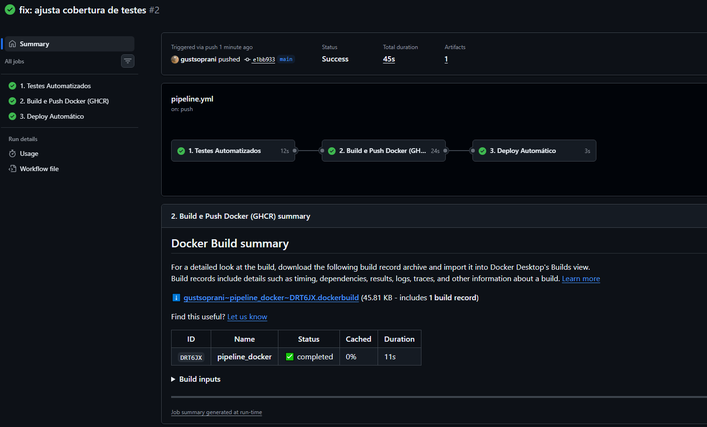
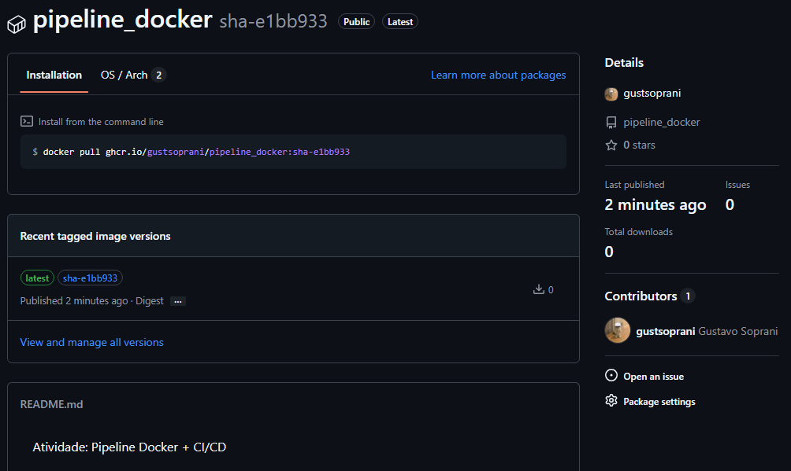
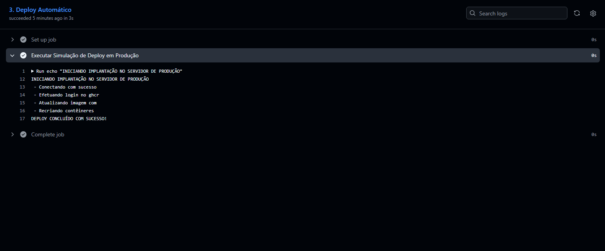

Atividade: Pipeline Docker + CI/CD

Como funciona o pipeline
O workflow roda em 3 etapas automáticas no arquivo ".github/workflows/pipeline.yml":
1. Testes: roda os testes com pytest e valida o mínimo de 70% de cobertura de código.
2. Build e Publicação (build-and-push): se os testes passarem na branch main, monta a imagem Docker e envia para o GHCR com as tags "latest" e o "sha" do commit.
3. Deploy: etapa final que simula a atualização do container no servidor de produção.

Como rodar local

1. Buildar a imagem:
```bash
docker build -t minha-app-cicd:1.0 .
```

2. Rodar o container:
```bash
docker run --rm minha-app-cicd:1.0
```

Evidências de funcionamento

1. Actions com os passos executados com sucesso:


2. Imagem publicada no GHCR (Packages):


3. Logs da execução do deploy:
